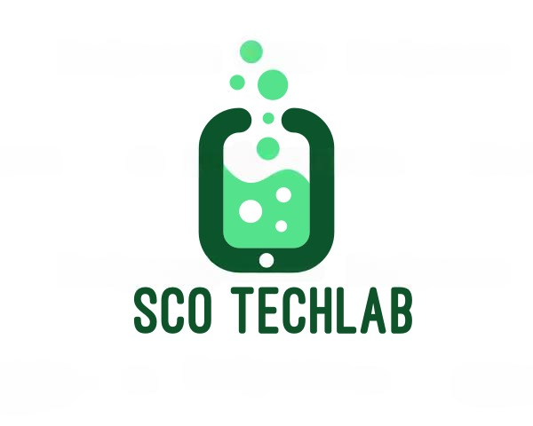

  

## Nest.JS i18n
Nest.JS i18n is a easy translate service for backend messages, is based in json files saved in a folder path.

### Get Started
- Install dependency
<pre>
npm i @sco-techlab/nestjs-websockets
</pre>
- Import Translate module in your 'app.module.ts' file, register or registerAsync methods availables
<pre>
@Module({
  imports: [

    // Register module example
    TranslateModule.register({
      default: 'en',
      path: './i18n',
      encoding: 'utf8',
      header: 'accept-language',
    }),

    // RegisterAsync module example
    TranslateModule.registerAsync({
      useFactory: () => {
        return {
          default: 'en',
          path: './i18n',
          encoding: 'utf8',
          header: 'accept-language',
        };
      },
    }),
  ],
})
export class AppModule {}
</pre>
- Module import is global mode, to use trasnalte service only need constructor dependency inyection
- Catch your 'accept-language' header request in your interceptor and set your current language
<pre>
@Injectable()
export class AppInterceptor implements NestInterceptor {

  constructor(private readonly translateService: TranslateService) {}

  intercept(context: ExecutionContext, next: CallHandler): Observable&lt;any&gt; {
    const request = context.switchToHttp().getRequest();
    this.translateService.setCurrentLang(this.translateService.requestLanguage(request));
    
    return next.handle().pipe(
      tap(() => {
        
      }),
      catchError((error) => {
        return throwError(() => error);
      }),
    );
  }
}
</pre>
- Add your interceptor to your 'app.module.ts' file if you have created it
<pre>
@Module({
  providers: [
    {
      provide: APP_INTERCEPTOR,
      useClass: AppInterceptor,
    },
  ],
})
export class AppModule {}
</pre>

### Nest.JS i18n config
<pre>
export class TranslateConfig {
  default: string; // default file name who whill load if no accept-language header provided or accept-language header value not exists
  path: string; // Path of the folder who contains the translate.json files
  encoding?: BufferEncoding; // Encoding of the translate.json file by default value is 'utf8'
  header?: string; // Header name to find the language to set to the service in the interceptor by default value is 'accept-language'
}
</pre>

### Translate files (JSON)
You should create the translation files with the following format 'language.json' such as 'en.json', 'es.json'...  
All translation files should be in the same folder, which is the path we configured in the module 

- En translates
<pre>
{
  "hello-world": "Hello world",
  "tests": {
    "test1": {
      "1": "First translate of tests / test1 block"
    }
  }
}
</pre>
- Es translates
<pre>
{
  "hello-world": "Hola mundo",
  "tests": {
    "test1": {
      "1": "Primera traducción del bloque tests / test1"
    }
  }
}
</pre>

### Translate method
For single translate like 'hello-world' in last translate files example you should pass the label name like argument
<pre>
translateService.translate('hello-world')
</pre>

For nested translates like 'tests / test1 / 1' you should pass the blocks and the translate of the JSON object like the last example
<pre>
translateService.translate('tests.test1.1')
</pre>

An other example for nested translate like 'tests / test1 / 1' you can pass the blocks of the JSON object in parent order as a string[] value
<pre>
translateService.translate(['tests', 'test1', '1'])
</pre>

If the translation does not exist, the method will return as a result the name of the translation passed by parameter to the translate method

### Examples
- Live coding: [Stackblitz example](https://stackblitz.com/edit/sco-techlab-nestjs-websockets?file=src%2Fapp.interceptor.ts)

## Author
Santiago Comeras Oteo
- <a href="https://web.sco-techlab.es/">SCO Techlab</a>
- <a href="https://github.com/SCO-Techlab">GitHub</a>
- <a href="https://www.npmjs.com/settings/sco-techlab/packages">Npm</a>
- <a href="https://www.linkedin.com/in/santiago-comeras-oteo-4646191b3/">LinkedIn</a>  

  

